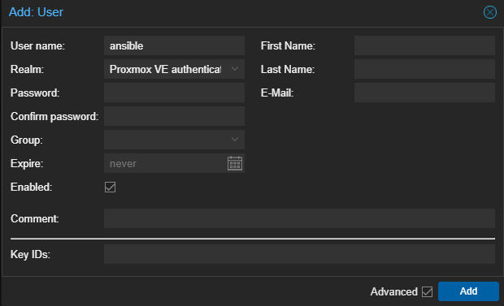
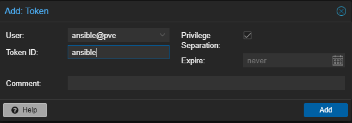
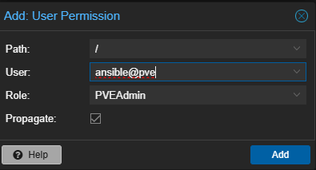
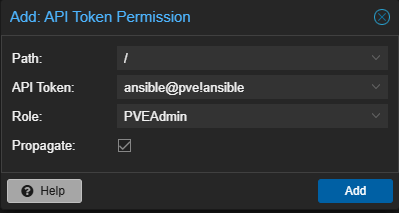

# Prerequisites
- Datacenter - Permissions - User - Add
<div class="user" align="center">
    
</div>

- Datacenter - Permissions - API Tokens - Add
<div class="user" align="center">
    
</div>

- Datacenter - Permissions - Add - User Permission
<div class="user" align="center">
    
</div>

- Datacenter - Permissions - Add - API Token Permission
<div class="user" align="center">
    
</div>

Verify that everything is working by running the following command:

```bash
curl -ki \
  -H 'Authorization: PVEAPIToken=ansible@pve!ansible=YOUR_TOKEN_SECRET' \
  https://YOUR_PROXMOX_IP:8006/api2/json/version
```

Install ansible collections:

```bash
apt update
apt install ansible python3-proxmoxer python3-requests -y
ansible-galaxy collection install community.proxmox
```

And verify that everything is working by running the following command:

```bash
ansible --version
ansible-galaxy collection list | grep community.proxmox
```

# Usage
Change variables in vars/proxmox.yaml and run the playbook:

```bash
ansible-playbook -i inventory/localhost.yaml playbooks/00-test.yaml
```

Change variables in vars/vms.yaml and run the playbook for creating VMs:

```bash
ansible-playbook -i inventory/localhost.yaml playbooks/01-create-vms.yaml
```

*use --limit 'name'* if needed to limit the playbook to a specific VM.
Install packages on VMs:

```bash
ansible-playbook -K -i inventory/hosts.yaml playbooks/02-post-install.yaml
```

Install docker on VMs:

```bash
ansible-playbook -K -i inventory/hosts.yaml playbooks/03-docker.yaml
```

Deploy docker containers on VMs:

```bash
ansible-playbook -K -i inventory/hosts.yaml playbooks/04-deploy-managemnt.yaml
ansible-playbook -K -i inventory/hosts.yaml playbooks/04-deploy-arr.yaml
ansible-playbook -K -i inventory/hosts.yaml playbooks/04-deploy-media.yaml
ansible-playbook -K -i inventory/hosts.yaml playbooks/04-deploy-personal.yaml
ansible-playbook -K -i inventory/hosts.yaml playbooks/04-deploy-nut.yaml
```

Reboot VMs:

```bash
ansible-playbook -K -i inventory/hosts.yaml playbooks/05-reboot-vms.yaml
```

Prepare Desktop:

```bash
ansible-playbook -K -i inventory/hosts.yaml playbooks/99-desktop.yaml
```