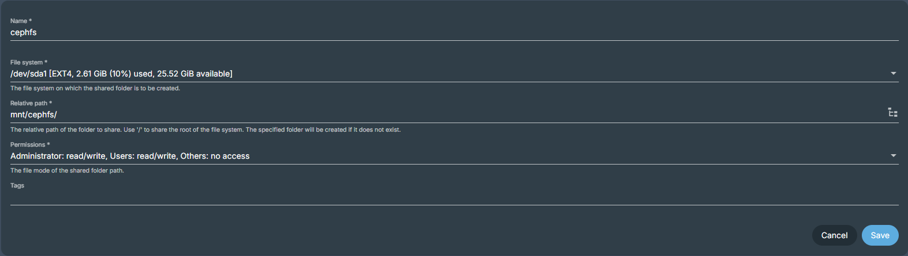

# Setup Ceph
Change variables in vars/ceph.yaml, inventory/hosts.yaml and run the playbooks:

```bash
ansible-playbook -K -i inventory/hosts.yaml playbooks/01-prepare-nodes.yaml
ansible-playbook -K -i inventory/hosts.yaml playbooks/02-deploy-ceph.yaml
ansible-playbook -K -i inventory/hosts.yaml playbooks/03-create-cephfs.yaml
```

Later if you want to add new nodes to the cluster, you can run the following playbook:

```bash
ansible-playbook -K -i inventory/hosts.yaml playbooks/04-add-nodes.yaml --limit new-node
```

NOTE: If you use OMV, you need to add new node into `/etc/fstab`.

# OMV
If you want to use OMV to access Ceph storage, you can configure it by running the following playbook:

```bash
ansible-playbook -K -i inventory/hosts.yaml playbooks/10-omv.yaml
```

Then do this steps in OMV:
1. Go to System > Plugins.
2. Search for `openmediavault-sharerootfs` and install it.
3. Go back to Storage > Shared Folders > Create (+).
4. Set it as shown in example below:

<div class="user" align="center">
    
</div>

5. Click Save and Apply.
6. Go to Users > User > Select created user > Edit > Create passowrd for the user.
7. Setup sharing services as needed.