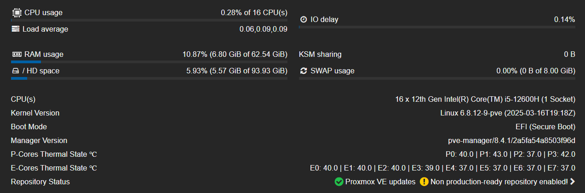

## Remove subscription popup:
```bash
cd /usr/share/javascript/proxmox-widget-toolkit
cp proxmoxlib.js proxmoxlib.js.bak
nano proxmoxlib.js
```
Replace the line:
`if (res ==`
with:
`if (false)`

## GPU passthrough
Edit grub `nano /etc/default/grub` and change:
```bash
GRUB_CMDLINE_LINUX_DEFAULT="quiet"

-- TO --

GRUB_CMDLINE_LINUX_DEFAULT="quiet intel_iommu=on pcie_acs_override=downstream,multifunction video=efifb:eek:ff"
```
Run `update-grub`

Edit modules `nano /etc/modules` and add:

```bash
vfio
vfio_iommu_type1
vfio_pci
vfio_virqfd
```

Then edit blaclist `nano /etc/modprobe.d/pve-blacklist.conf` to this:
```bash
blacklist nvidiafb
blacklist nvidia
blacklist radeon
blacklist nouveau
```

Lastly `reboot`

## CPU temperature:
Install `lm-sensors` with `apt install lm-sensors` and then run `sensors` to see all sensors.

<div class="intro" align="center">
    
</div>

Open `/usr/share/perl5/PVE/API2/Nodes.pm` and find:
```bash
$res->{pveversion} = PVE::pvecfg::package() . "/" .
    PVE::pvecfg::version_text();
 
my $dinfo = df('/', 1);     # output is bytes
```
Add line:
```bash
$res->{pveversion} = PVE::pvecfg::package() . "/" .
    PVE::pvecfg::version_text();
 
$res->{thermalstate} = `sensors`;

my $dinfo = df('/', 1);     # output is bytes
```

Then open `/usr/share/pve-manager/js/pvemanagerlib.js` and find:
```bash
Ext.define('PVE.node.StatusView', {
extend: 'PVE.panel.StatusView',
alias: 'widget.pveNodeStatus',

height: 300,
bodyPadding: '5 15 5 15',

layout: {
    type: 'table',
    columns: 2,
    tableAttrs: {
        style: {
            width: '100%'
        }
    }
},
```
Change `bodyPadding: '5 15 5 15'` to `bodyPadding: '20 15 20 15'` and `height` - this depends on how many sensors you have.

In the same file, find:
```bash
{
    itemId: 'version',
    colspan: 2,
    printBar: false,
    title: gettext('PVE Manager Version'),
    textField: 'pveversion',
    value: ''
}
```

And add - change for number of sensors:
```bash
{
    itemId: 'thermal1',
    colspan: 2,
    printBar: false,
    title: gettext('P-Cores Thermal State ℃'),
    textField: 'thermalstate',
    renderer:function(value){
        const c0 = value.match(/Core 0.*?\+([\d\.]+)Â/)[1];
        const c1 = value.match(/Core 4.*?\+([\d\.]+)Â/)[1];
        const c2 = value.match(/Core 8.*?\+([\d\.]+)Â/)[1];
        const c3 = value.match(/Core 12.*?\+([\d\.]+)Â/)[1];
        return `P0: ${c0} | P1: ${c1} | P2: ${c2} | P3: ${c3}`
        }
},
{
    itemId: 'thermal2',
    colspan: 2,
    printBar: false,
    title: gettext('E-Cores Thermal State ℃'),
    textField: 'thermalstate',
    renderer:function(value){
        const c0 = value.match(/Core 16.*?\+([\d\.]+)Â/)[1];
        const c1 = value.match(/Core 17.*?\+([\d\.]+)Â/)[1];
        const c2 = value.match(/Core 18.*?\+([\d\.]+)Â/)[1];
        const c3 = value.match(/Core 19.*?\+([\d\.]+)Â/)[1];
        const c4 = value.match(/Core 20.*?\+([\d\.]+)Â/)[1];
        const c5 = value.match(/Core 21.*?\+([\d\.]+)Â/)[1];
        const c6 = value.match(/Core 22.*?\+([\d\.]+)Â/)[1];
        const c7 = value.match(/Core 23.*?\+([\d\.]+)Â/)[1];
        return `E0: ${c0} | E1: ${c1} | E2: ${c2} | E3: ${c3} | E4: ${c4} | E5: ${c5} | E6: ${c6} | E7: ${c7}`
        }
}  
```

And lastly type `systemctl restart pveproxy` to apply changes.

Final result should look like this:
<div class="intro" align="center">
    
</div>