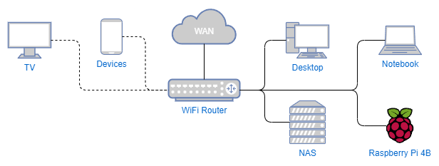
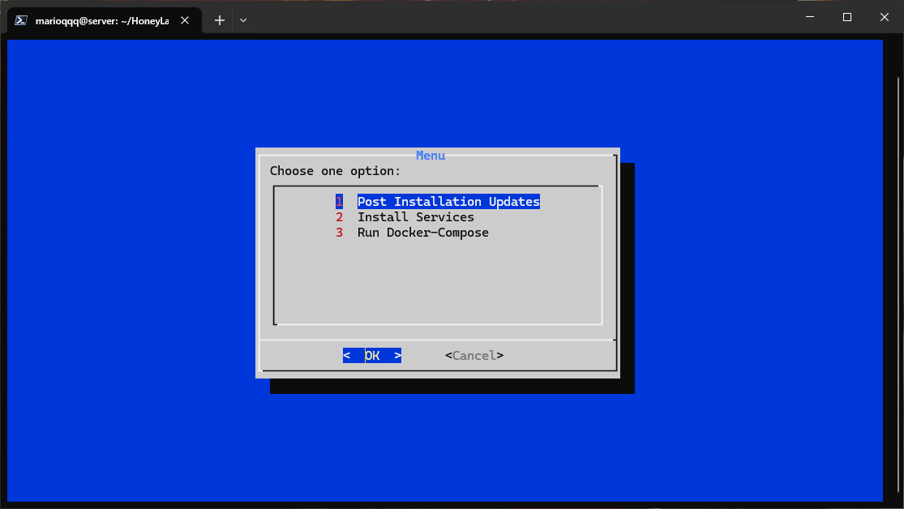
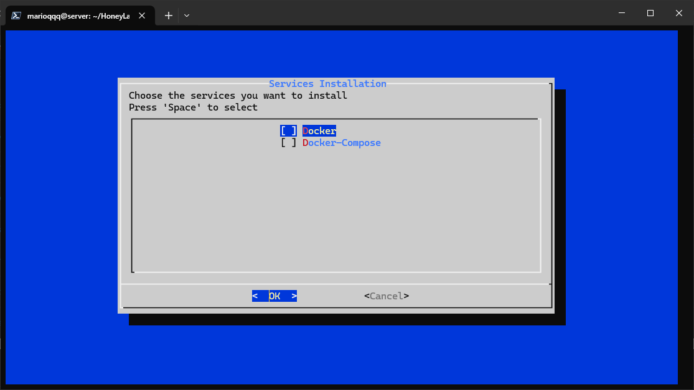
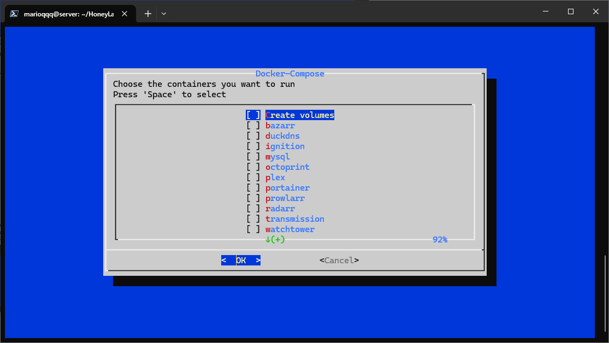

# HoneyLab

    

This repository is a collection of services that I use. Purpose of this repository is to make it easier to install and configure these services after fresh install. Currently I run an Ubuntu VM inside my TrueNas.

## ToC
- [1. My network configuration](#1-my-network-configuration)
- [2. To begin](#2-to-begin)
    - [2.1 Post Installation Update](#21-post-installation-update)
    - [2.2 Install Services](#22-install-services)
        - [2.2.1 Docker](#221-docker)
        - [2.2.2 Docker-Compose](#222-docker-compose)
        - [2.2.3 Avahi](#223-avahi)
    - [2.3 Run Docker-Compose](#23-run-docker-compose)
- [3. To end](#3-to-end)
- [TODO](#todo)

## 1. My configuration

    

I'm not a network expert, so I don't know if this is a good representation of my network. After all services are running, I will update this configuration.

## 2. To begin
`run.sh` consists of Post Installation Update, Install Sercices, Run Docker-Compose and ArgonOne Configuration. To run this script, it is necessary to execute `chmod +x run.sh`. After that, you can run the script with `./run.sh`.
After starting it will check if `dialog` is installed. If not it will install it using `sudo apt install dialog -y`. After that, it will show a menu.

    

### 2.1 Post Installation Update
This will execute `sudo apt update && sudo apt upgrade -y && sudo apt autoremove -y`

### 2.2 Install Services
Currently, there are only 4 services available. - change picture

    

#### 2.2.1 Docker
Checks if already installed. If not it will execute `sudo apt install docker.io -y`

#### 2.2.2 Docker-Compose
Checks if already installed. If not it will execute `sudo apt install docker-compose -y`

#### 2.2.3 Avahi
Checks if already installed. If not it will execute `sudo apt install avahi-daemon avahi-utils -y`

### 2.3 Run Docker-Compose
You can select containers that will be started.

    

## 3. To end
When you are done, you can exit the menu with `Cancel`.

## TODO
- [x] Make `run.sh` running at least partially
- [x] Run few docker containers
- [x] Make `readme.md`
- [ ] Redo network diagram
- [x] Make service diagram - won't make
- [x] Finish `run.sh`
- [x] Add additional services - won't add
- [ ] Make Docker-Compose work with option to edit variables
- [x] Run all services
- [x] Make additional `readme.md` for each container - not needed
- [ ] Finish `readme.md`