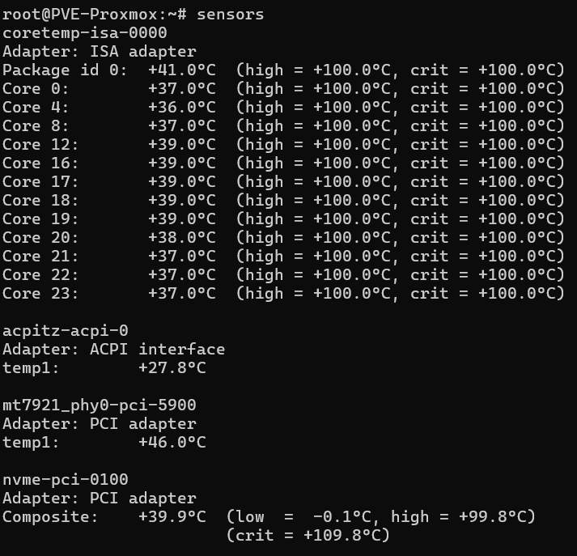
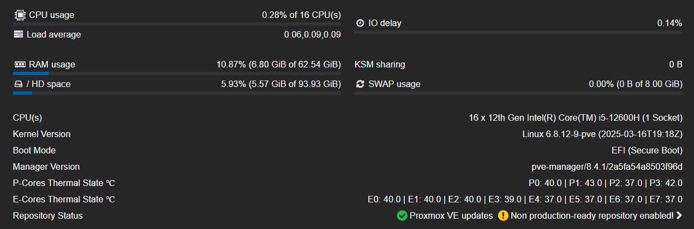

# HoneyLab
<div class="intro" align="center">
    
</div>

This repository contains scripts and docker containers for each machine / VM after fresh install. It is spread across multiple folders, depending on the purpose of the machine.

<div class="intro" align="center">
    
</div>

*[Icons](https://github.com/free-icons/free-icons)

# Proxmox
## Remove subscription popup:
```bash
cd /usr/share/javascript/proxmox-widget-toolkit
cp proxmoxlib.js proxmoxlib.js.bak
nano proxmoxlib.js
```
Replace the line:
`if (res ==`
with:
`if (false)`

## CPU temperature:
Install `lm-sensors` with `apt install lm-sensors` and then run `sensors` to see all sensors.

<div class="intro" align="center">
    
</div>

Open `/usr/share/perl5/PVE/API2/Nodes.pm ` and find:
```bash
$res->{pveversion} = PVE::pvecfg::package() . "/" .
    PVE::pvecfg::version_text();
 
my $dinfo = df('/', 1);     # output is bytes
```
Add line:
```bash
$res->{pveversion} = PVE::pvecfg::package() . "/" .
    PVE::pvecfg::version_text();
 
$res->{thermalstate} = `sensors`;

my $dinfo = df('/', 1);     # output is bytes
```

Then open `/usr/share/pve-manager/js/pvemanagerlib.js` and find:
```bash
Ext.define('PVE.node.StatusView', {
extend: 'PVE.panel.StatusView',
alias: 'widget.pveNodeStatus',

height: 300,
bodyPadding: '5 15 5 15',

layout: {
    type: 'table',
    columns: 2,
    tableAttrs: {
        style: {
            width: '100%'
        }
    }
},
```
Change `bodyPadding: '5 15 5 15'` to `bodyPadding: '20 15 20 15'` and `height` - this depends on how many sensors you have.

In the same file, find:
```bash
{
    itemId: 'version',
    colspan: 2,
    printBar: false,
    title: gettext('PVE Manager Version'),
    textField: 'pveversion',
    value: ''
}
```

And add - change for number of sensors:
```bash
{
    itemId: 'thermal1',
    colspan: 2,
    printBar: false,
    title: gettext('P-Cores Thermal State ℃'),
    textField: 'thermalstate',
    renderer:function(value){
        const c0 = value.match(/Core 0.*?\+([\d\.]+)Â/)[1];
        const c1 = value.match(/Core 4.*?\+([\d\.]+)Â/)[1];
        const c2 = value.match(/Core 8.*?\+([\d\.]+)Â/)[1];
        const c3 = value.match(/Core 12.*?\+([\d\.]+)Â/)[1];
        return `P0: ${c0} | P1: ${c1} | P2: ${c2} | P3: ${c3}`
        }
},
{
    itemId: 'thermal2',
    colspan: 2,
    printBar: false,
    title: gettext('E-Cores Thermal State ℃'),
    textField: 'thermalstate',
    renderer:function(value){
        const c0 = value.match(/Core 16.*?\+([\d\.]+)Â/)[1];
        const c1 = value.match(/Core 17.*?\+([\d\.]+)Â/)[1];
        const c2 = value.match(/Core 18.*?\+([\d\.]+)Â/)[1];
        const c3 = value.match(/Core 19.*?\+([\d\.]+)Â/)[1];
        const c4 = value.match(/Core 20.*?\+([\d\.]+)Â/)[1];
        const c5 = value.match(/Core 21.*?\+([\d\.]+)Â/)[1];
        const c6 = value.match(/Core 22.*?\+([\d\.]+)Â/)[1];
        const c7 = value.match(/Core 23.*?\+([\d\.]+)Â/)[1];
        return `E0: ${c0} | E1: ${c1} | E2: ${c2} | E3: ${c3} | E4: ${c4} | E5: ${c5} | E6: ${c6} | E7: ${c7}` >                }
}  
```

And lastly type `systemctl restart pveproxy` to apply changes.

Final result should look like this:
<div class="intro" align="center">
    
</div>

# Ansible
Before using Ansible, update your system and install following packages on host:
```bash
sudo apt install ansible sshpass -y
```

And other machines:
```bash
sudo apt install ansible -y
```

Before first use, create config file and change `host_key_checking` to `False`:
```bash
ansible-config init --disabled > ansible.cfg
```

Then edit [hosts](/Ansible/inventory/hosts) file.

Test connection to all machines:
```bash
ansible -i ./Ansible/inventory/hosts SRV_Collection -m ping --ask-pass
```

To run playbook, use:
```bash
ansible-playbook ./Ansible/playbooks/ssh-key.yaml -i ./Ansible/inventory/hosts --ask-pass
ansible-playbook ./Ansible/playbooks/SRV-Management.yaml -i ./Ansible/inventory/hosts --ask-become-pass
ansible-playbook ./Ansible/playbooks/SRV-Media.yaml -i ./Ansible/inventory/hosts --ask-become-pass
ansible-playbook ./Ansible/playbooks/SRV-Personal.yaml -i ./Ansible/inventory/hosts --ask-become-pass
```

# Before use
Before using this repo you may need to install git.
```bash
sudo apt install git -y
```

# PC-Personal postInstall.sh
To run script, you need to make it executable:
```bash
chmod +x postInstall.sh
```
Script will perform update and upgrade of the system, sets user do use docker without `sudo` and sets timezone. After that, it will install / remove following packages:

- ❌ LibreOffice
- Brave browser
- ❌ Firefox
- Docker
- Docker-compose
- VS Code
- DBeaver
- FileZilla
- Discord
- Wireguard
- Thunderbird

# Container docs
Docs for containers and services on each machine / VM:
- [SRV-Cloud](/SRV-Cloud/readme.md)
- [SRV-Management](/SRV-Management/readme.md)
- [SRV-Media](/SRV-Media/readme.md)
- [SRV-Personal](/SRV-Personal/readme.md)
- [Misc](/Misc/readme.md)