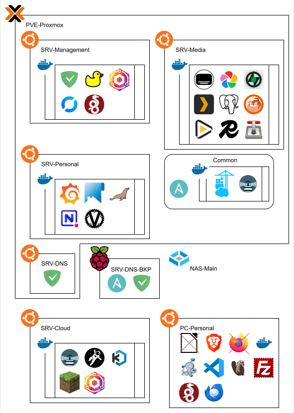

# HoneyLab
<div class="intro" align="center">
    
</div>

This repository contains scripts and docker containers for each machine / VM after fresh install. It is spread across multiple folders, depending on the purpose of the machine.

<!-- <div class="intro" align="center">
    
</div>

*[Icons](https://github.com/free-icons/free-icons) -->

# Before use
Before using this repo you may need to install git.
```bash
sudo apt install git -y
```

<!-- # PC-Personal postInstall.sh
To run script, you need to make it executable:
```bash
chmod +x postInstall.sh
```
Script will perform update and upgrade of the system, sets user do use docker without `sudo` and sets timezone. After that, it will install / remove following packages:

- ❌ LibreOffice
- Brave browser
- ❌ Firefox
- Docker
- Docker-compose
- VS Code
- DBeaver
- FileZilla
- Discord
- Wireguard
- Thunderbird -->

# Adguard home
[Adguard home blacklists](https://firebog.net/)