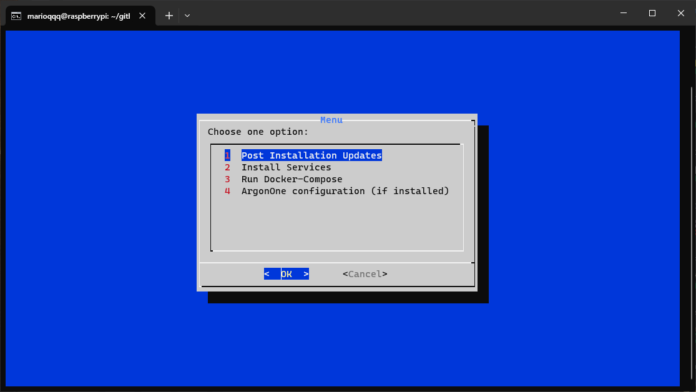

# HoneyLab

    

This repository is a collection of services that I use. Purpose of this repository is to make it easier to install and configure these services after fresh install. I'm using Raspberry Pi 4 with 8GB of RAM and Raspberry Pi OS Lite (64-bit) released 11.12.2023. Currently few of my services are running at my NAS, but due to power consumption I decided to move them to Raspberry Pi.

## My network configuration

    

I'm not a network expert, so I don't know if this is a good representation of my network. After all services are running, I will update this configuration.

## To begin
`run.sh` consists of Post Installation Update, Install Sercices, Run Docker-Compose and ArgonOne Configuration. To run this script, it is necessary to execute `chmod +x run.sh`. After that, you can run the script with `./run.sh`.
After starting it will check if `dialog` is installed. If not it will install it using `sudo apt install dialog -y`. After that, it will show a menu.

    

### Post Installation Update
This will execute `sudo apt update && sudo apt upgrade -y && sudo apt autoremove -y`

### Install Services
Currently, there are 4 services available. But PiVPN is not working yet. More services will be added soon.

    

#### Docker
Checks if already installed. If not it will execute `sudo apt install docker.io -y`

#### Docker-Compose
Checks if already installed. If not it will execute `sudo apt install docker-compose -y`

#### PiVPN
Currently not working.

#### ArgonOne
It will check if directory `/etc/argon` exists. If not it will execute `curl https://download.argon40.com/argon1.sh | bash`. Not sure if this is the best way to find if ArgonOne is installed.

### Run Docker-Compose
Currently not working.

### ArgonOne Configuration
It will run Argon Configuration tool.

    

## To end
When you are done, you can exit the menu with `Cancel`. After that, you will be asked if you want to reboot.

    

## TODO
- [x] Make `run.sh` running at least partially
- [x] Run few docker containers
- [ ] Make `readme.md`
- [ ] Redo network diagram
- [ ] Finish `run.sh`
- [ ] Add additional services
- [ ] Make Docker-Compose work with option to edit variables
- [ ] Run all services
- [ ] Make additional `readme.md` for each container
- [ ] Finish `readme.md`